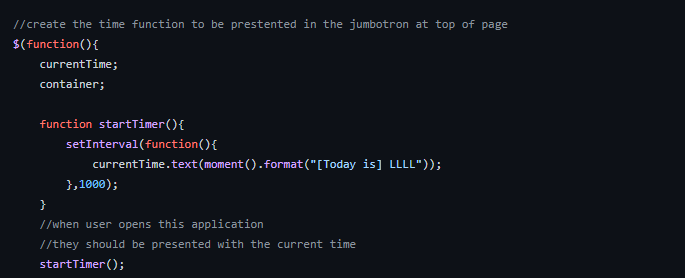
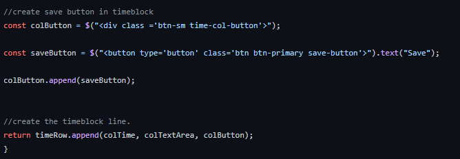

# 05-Daily-Planner

Refactor of daily planner using JQuery to create time entries and have them save to local storage in order to be recalled presented.

This project has been deployed to GitHub pages. To access this project click the deployement link below:

https://github.com/dgourley84/05-Daily-Planner

Or, download the source files to use as a template.

# Getting Started

This project has been deployed to GitHub Pages. To access this project click the deployment link below. Or, download the sources files to use this as a template.

- https://github.com/dgourley84/05-Daily-Planner
- https://dgourley84.github.io/05-Daily-Planner/

# Pre-requisites

If you wish to use this as a template you will need a text editor. Visual Studio Code was used to create this project and is the recomended application.

# Installing

To install this code, download the zip file, or use GitHub's guidelines to clone the repository.

# Summary

This project utilises jquery, bootstrap & moment.js to refactor HTML to create a daily planner that allows user to input their activities, have them save the entries so when the page is reloaded those entries remain and a colour coding system that allows a user to quickly assess the hour and activity relevent at that particular time of the day.

Upon opening the planner the user will be presented with the following landing page:

# Features

This project has the following features:

## Current time and date
As part of the jumbotron at top of the page the user is presented with the current time and date and day using moment.js. The following code enables the current time be formulated in the applications JavaScript and presented in the html using the id structure that is defined as a global constant:

The banner of the jumbotron also provides instructions on how to enter items into the timeblocks and remove text as well

## Timeblocks

Timeblocks appear as follows:

Each block as the time for that entry logged in 24hour time, a field for text to be input, a save button to save the text to appear upon the page reloading and also color coding to quickly determin if the entry is in the past, present or future.

In order to create the blocks jquery has been used to create each row - then iterate over the defined number of blocks rquired and be "pushed" into the html file. This functionality is achieved through the following:

## Event entry

Within each row of the time block there is a free text section that allows the user to input their activities. Upon first loading the page the user is presented with placeholder text "Enter event here and click save". Upon clicking save the text is saved to local storage so upon reloading the page the activities are reloaded into the relevant time block. The following is the result:

This functionality is achieved through the following code:

To clear the activities the user deletes the text and clicks save.

# To excute file

Open in brower and follow instructions at top of page

# Features

- one html page provided by UWA
    - index.html
    - amended and refactored as required
- one CSS page provided by UWA
    - style.css
    - amended and refactored as required
- one Javascript page
    - script.js
    - created with all logic and code above
- use of the following third party API's
    - moment.js - https://cdnjs.cloudflare.com/ajax/libs/moment.js/2.24.0/moment.min.js
    - bootstrap - https://stackpath.bootstrapcdn.com/bootstrap/4.3.1/css/bootstrap.min.css
    - google fonts - https://fonts.googleapis.com/css?family=Open+Sans&display=swap
    - jquery - https://code.jquery.com/jquery-3.4.1.min.js 

# Authors
- Dallas Gourley
- UWA Coding Bootcamp for base HTML and CSS to refactor
- Various code found online and repurposed to fit the requirements

# Acknowledments
Thanks to Sam Ngu, Evan Woods and Navepreet Ahuja for tutorial guidence and inspiration.
